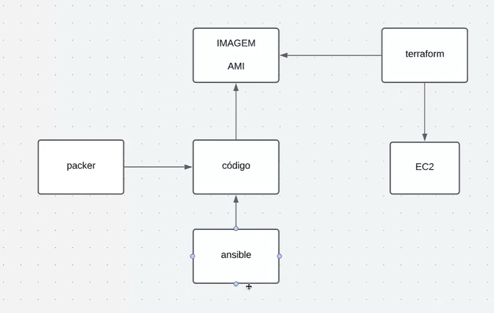
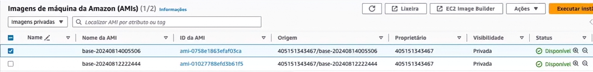

# Packer Ubuntu Base Image

Este repositório contém um projeto focado em demonstrar o funcionamento do processo de build de imagens com o Packer.

O objetivo principal é documentar e automatizar a criação de uma AMI Ubuntu base usando o builder `amazon-ebs`. A integração com Ansible e o consumo da imagem final via Terraform fazem parte da evolução natural do projeto.

## Objetivo

Criar uma imagem AMI personalizável no AWS EC2 com Ubuntu 20.04 (Focal), preparada para ser usada como base em pipelines de infraestrutura e deployment.

## Status do projeto

- Packer build integrado com provisionamento Ansible para Docker.
- `source.pkr.hcl` configura `amazon-ebs` e replica a AMI para `us-east-2` e `us-west-2`.
- `build.pkr.hcl` usa o provisioner `ansible` para aplicar o playbook `ansible/playbook.yml`.
- `ansible/` contém inventário, playbook e requisitos de Galaxy para a role Docker.

## Visão geral da arquitetura

- `init.pkr.hcl` define os requisitos de plugin do Packer, garantindo que o plugin AWS (`amazon`) esteja disponível.
- `source.pkr.hcl` configura o builder `amazon-ebs`:
  - Usa como base a AMI oficial do Ubuntu 20.04 em `us-east-1`.
  - Define o username SSH padrão via variável `user`.
  - Gera nome de imagem com carimbo de data/hora ou `release` customizada.
- `build.pkr.hcl` monta a build básica e usa um provisioner Ansible para aplicar o playbook Docker.
- `variables.pkr.hcl` define parâmetros customizáveis do projeto.



## Como funciona

1. O Packer consulta a AMI oficial do Ubuntu 20.04 usando o data source `amazon-ami`.
2. O builder `amazon-ebs` instancia uma VM temporária na AWS.
3. Uma nova AMI é criada com tags e nome customizado.

> Observação: o projeto já contém assets Ansible em `ansible/` e o `packer build` atual executa o playbook via provisioner Ansible.

## Arquivos principais

- `init.pkr.hcl`
  - Declara o plugin obrigatório `amazon` com versão `>= 1.2.8`.
- `source.pkr.hcl`
  - Define o source `amazon-ebs.imagem-base`.
  - Usa `data.amazon-ami.ubuntu` para localizar a AMI Ubuntu 20.04 mais recente.
  - Cria metadata com tags como `OS_Version`, `Release`, `Base_AMI_Name` e `Extra`.
  - Suporta múltiplas regiões através de `ami_regions`, replicando a AMI criada para regiões adicionais.
- `build.pkr.hcl`
  - Define a build baseada em `source.amazon-ebs.imagem-base`.
  - Executa o provisioner Ansible para aplicar `ansible/playbook.yml` durante o build.
- `variables.pkr.hcl`
  - `user`: usuário SSH padrão para a instância (`ubuntu` por padrão).
  - `release`: tag opcional para versionamento de imagem.

## Uso

1. Instalar o Packer e o plugin `amazon`.
2. Configurar credenciais AWS no ambiente (`AWS_ACCESS_KEY_ID`, `AWS_SECRET_ACCESS_KEY`, etc.).
3. Navegar até o diretório do projeto.
4. Executar:

```bash
packer init .
packer build .
```

5. O Packer criará a AMI na região `us-east-1`.

## Ansible

O diretório `ansible/` contém:
- `inventory`: inventário de hosts
- `playbook.yml`: playbook que aplica o role `geerlingguy.docker` e habilita Docker Compose
- `requirements.yml`: requisitos Galaxy usados pelo provisioner Ansible

O `packer build` executa este playbook automaticamente durante o build da AMI.

Para testar separadamente:

```bash
cd ansible
ansible-playbook -i inventory playbook.yml
```

## Variáveis de build

- `user`: define o usuário SSH padrão. Default: `ubuntu`.
- `release`: controla o sufixo/tag de release da AMI. Default: `""` (usa timestamp).

## Resultado final


## Diferenciais deste projeto

- Uso de `amazon-ebs` para criar AMIs automaticamente.
- Configuração de provisionamento via Ansible para modularidade e manutenção.
- Tagging consistente para rastreamento de versão e origem de AMI.
- Design apropriado para pipelines CI/CD com possibilidade de usar `release` para builds determinísticos.

## Configurações avançadas

### Múltiplas regiões

O parâmetro `ami_regions` em `source.pkr.hcl` permite replicar a AMI criada para múltiplas regiões AWS automaticamente:

```hcl
ami_regions = ["us-east-2", "us-west-2"]
```

Isso garante que a imagem base esteja disponível em diferentes regiões para reduzir latência e cumprir requisitos de disaster recovery.

## Próximas etapas

1. **Validar build**: testar `packer build` e confirmar o provisionamento Ansible.
2. **Testes e validação**: adicionar `post-processors` ou validação automática para a AMI gerada.
3. **Consumo com Terraform**: criar projeto separado que usa a AMI final.
4. **Pipeline CI/CD**: integrar o build com GitHub Actions ou outro orquestrador.

